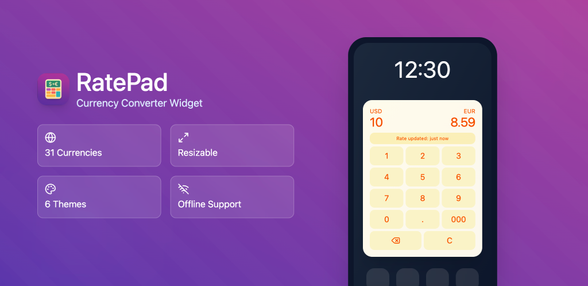
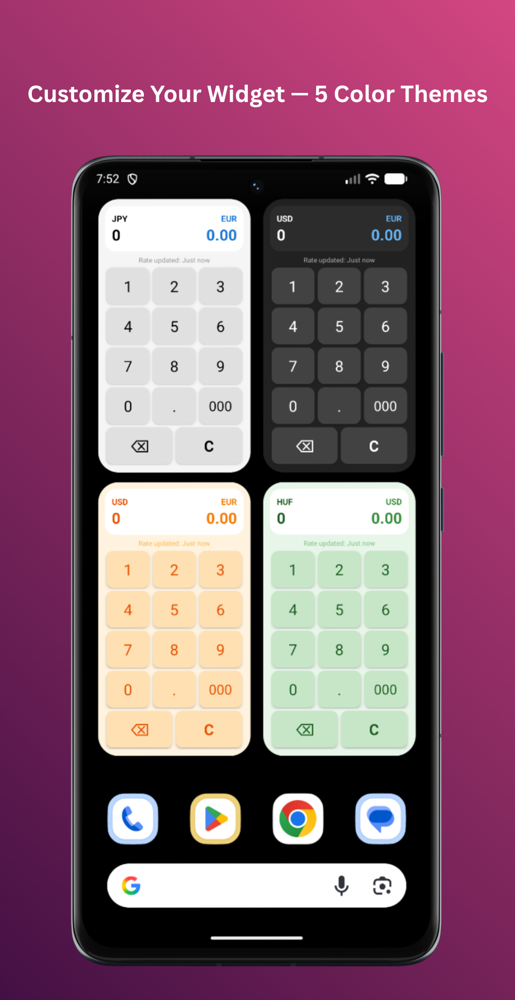

# RatePad – Currency Converter Widget for Android

[](https://kotlinlang.org/)
[](https://developer.android.com/)
[](https://square.github.io/retrofit/)
[](https://kotlinlang.org/docs/coroutines-overview.html)

A home screen widget that provides a calculator-style interface for real-time currency conversion between major currencies.

📱 **Get it on Google Play**: [RatePad - Currency Widget](https://play.google.com/store/apps/details?id=com.ilmariware.currencyconverterwidget)

<table>
<tr>
<td width="60%" valign="top">

</td>
<td width="40%" valign="top">

</td>
</tr>
</table>

## 🎯 Overview

This Android widget allows users to convert currencies directly from their home screen without opening an app. It features:

- Calculator-style number pad interface
- Real-time conversion as you type
- Support for 31 major currencies with grouped display (9 common + 22 additional)
- Five color themes (Classic, Dark, Ocean Blue, Mint Green, Sunset)
- Configurable update intervals (12 hours, daily, weekly)
- Offline functionality with cached exchange rates
- Automatic periodic rate updates via WorkManager
- Display of last rate update timestamp

## 🛠️ Technical Stack

- **Language**: Kotlin
- **Min SDK**: 26 (Android 8.0)
- **Target SDK**: 36
- **Architecture**: MVVM-like with Repository pattern
- **API**: Frankfurter API (European Central Bank data, free, no key required)
- **Libraries**:
  - Retrofit 2.9.0 - API calls
  - Gson 2.10.1 - JSON parsing
  - WorkManager 2.9.0 - Scheduled background updates
  - Coroutines 1.7.3 - Async operations

## 📁 Project Structure

```
app/src/main/java/com/ilmariware/currencyconverterwidget/
├── MainActivity.kt                          # Info screen when app is opened
├── WidgetConfigurationActivity.kt           # Widget setup screen
├── data/
│   ├── CurrencyRepository.kt               # API calls & caching logic
│   ├── ExchangeRateApi.kt                  # Retrofit interface
│   ├── WidgetPreferences.kt                # SharedPreferences wrapper
│   └── models/
│       ├── Currency.kt                     # Currency enum (31 currencies)
│       ├── ExchangeRate.kt                 # Data models
│       └── UpdateFrequency.kt              # Update interval enum
└── widget/
    ├── CurrencyConverterWidget.kt          # AppWidgetProvider - main widget logic
    ├── WidgetCalculator.kt                 # Calculator input handling
    └── WidgetUpdateWorker.kt               # WorkManager for scheduled updates

app/src/main/res/
├── layout/
│   ├── activity_main.xml                   # Main activity layout
│   ├── activity_widget_configuration.xml   # Configuration UI
│   └── widget_layout.xml                   # Widget layout (3x3 cells)
└── xml/
    └── widget_info.xml                     # Widget metadata (size, config)
```

## 🔑 Key Components

### 1. Supported Currencies

The widget supports **31 major world currencies** organized in two groups:

**Common Currencies (9):**

- USD (US Dollar)
- EUR (Euro)
- GBP (British Pound)
- JPY (Japanese Yen)
- CAD (Canadian Dollar)
- AUD (Australian Dollar)
- CHF (Swiss Franc)
- CNY (Chinese Yuan)
- INR (Indian Rupee)

**All Currencies (22 additional):**

- BGN (Bulgarian Lev)
- BRL (Brazilian Real)
- CZK (Czech Koruna)
- DKK (Danish Krone)
- HKD (Hong Kong Dollar)
- HUF (Hungarian Forint)
- IDR (Indonesian Rupiah)
- ILS (Israeli Shekel)
- ISK (Icelandic Króna)
- KRW (South Korean Won)
- MXN (Mexican Peso)
- MYR (Malaysian Ringgit)
- NOK (Norwegian Krone)
- NZD (New Zealand Dollar)
- PHP (Philippine Peso)
- PLN (Polish Złoty)
- RON (Romanian Leu)
- SEK (Swedish Krona)
- SGD (Singapore Dollar)
- THB (Thai Baht)
- TRY (Turkish Lira)
- ZAR (South African Rand)

In the configuration screen, currencies are displayed in a grouped dropdown with section headers for easy navigation.

### 2. Widget Configuration Flow

When user adds widget:

1. `WidgetConfigurationActivity` opens
2. User selects source/target currencies from grouped dropdown
3. User selects color theme with preview
4. User selects update frequency (12h/daily/weekly)
5. Activity fetches initial exchange rate from API
6. Configuration saved to SharedPreferences
7. WorkManager schedules periodic updates
8. Widget is created and displayed

### 3. Exchange Rate Management

- **API**: `https://api.frankfurter.app/latest?base={currency}`
- **Caching**: Rates stored in SharedPreferences with timestamp
- **Offline**: Widget uses cached rates when network unavailable
- **Updates**: WorkManager fetches new rates based on user preference

### 4. Calculator Logic

`WidgetCalculator` handles all input:

- Numbers 0-9
- Decimal point (.)
- Triple zero (000) for quick entry
- Backspace (⌫) to delete last digit
- Clear (C) to reset to 0
- Max input length: 12 characters

### 5. Widget Update Mechanism

Widget updates happen via:

1. **User input**: Button clicks trigger immediate recalculation
2. **Scheduled updates**: WorkManager fetches new rates periodically
3. **Button clicks**: Each button has PendingIntent broadcast receiver

## ⚙️ Configuration

### Widget Dimensions

Current: **3x3 cells** (180dp x 180dp)

Defined in `widget_info.xml`:

```xml
android:targetCellWidth="3"
android:targetCellHeight="3"
android:minWidth="180dp"
android:minHeight="180dp"
```

### Supported Currencies

Defined in `Currency.kt`:

To add more: Edit `Currency` enum and ensure API supports them.

### Update Frequencies

Defined in `UpdateFrequency.kt`:

- TWELVE_HOURS: Every 12 hours
- DAILY: Every 24 hours
- WEEKLY: Every 168 hours

## 🚀 Development Setup

### 📋 Prerequisites

- Android Studio (latest version)
- JDK 17 or higher
- Android SDK 26+

### 🔨 Building

1. Open project in Android Studio
2. Sync Gradle dependencies
3. Select device/emulator
4. Run app

### 📲 Adding Widget to Home Screen

1. Long-press on home screen
2. Tap "Widgets"
3. Find "RatePad"
4. Drag to home screen
5. Configure currencies and update frequency

## 🌐 API Information

**Frankfurter API**

- Base URL: `https://api.frankfurter.app/`
- Endpoint: `/latest?base={CURRENCY_CODE}`
- Rate limit: No official limit, but be respectful
- Data source: European Central Bank
- Update frequency: Daily (around 4 PM CET)
- Free tier: Unlimited requests
- No API key required

Example response:

```json
{
  "amount": 1.0,
  "base": "USD",
  "date": "2025-11-15",
  "rates": {
    "EUR": 0.86423,
    "GBP": 0.77234,
    ...
  }
}
```

## 📝 License

This project is licensed under the GNU General Public License v3.0 (GPL-3.0).

This program is free software: you can redistribute it and/or modify it under the terms of the GNU General Public License as published by the Free Software Foundation, either version 3 of the License, or (at your option) any later version.

This program is distributed in the hope that it will be useful, but WITHOUT ANY WARRANTY; without even the implied warranty of MERCHANTABILITY or FITNESS FOR A PARTICULAR PURPOSE. See the GNU General Public License for more details.

You should have received a copy of the GNU General Public License along with this program. If not, see <https://www.gnu.org/licenses/>.
